# BDD100K Dataset Analysis: Object Detection for ADAS
**Document Purpose:** Detailed exploratory data analysis (EDA) of the BDD100K 100k-image subset for 2D object detection. 

---

## 1. Executive Summary

An in-depth analysis of the BDD100K detection subset reveals a highly diverse but severely imbalanced dataset, typical of real-world unconstrained driving environments. With **69,863 training frames** and **~1.28 million annotated objects**, the dataset provides a rich foundation for training robust perception models. However, three critical challenges must be addressed during the architectural design and training phases:

1. **Severe Class Imbalance:** A long-tail distribution heavily skewed towards `car` and `traffic sign` classes, with critical edge-case classes like `train` and `rider` being severely underrepresented.
2. **Scale Imbalance (The Small Object Problem):** The vast majority of annotations fall into the "small" object category, necessitating high-resolution feature maps (e.g., FPN layer P2/P3 utilization) and potentially scale-balanced sampling.
3. **High Environmental Variance:** A strong representation of night-time driving (40%) and adverse weather conditions requires careful augmentation and potentially domain-adaptive training strategies to prevent performance degradation under domain shift.

---

## 2. Global Dataset Statistics & Composition

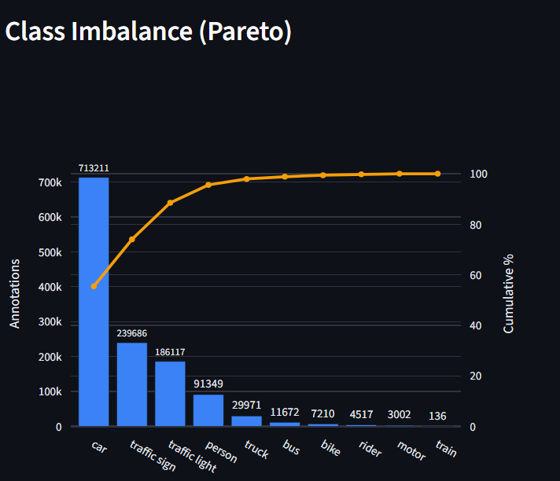

The dataset contains an average of **18.4 objects per frame**, indicating high-density urban scenes. 

The Pareto chart highlights a classic long-tail class distribution:
* **Head Classes:** `car` (713k instances) and `traffic sign` (239k instances) dominate the dataset, accounting for roughly 75% of all bounding boxes.
* **Tail Classes:** Classes like `bus`, `bike`, `rider`, `motor`, and `train` form the extreme tail. For instance, `train` has only 136 instances across the entire training set.

**Engineering Insight:** Standard Cross-Entropy loss will cause the model to over-optimize for cars and ignore minority classes. Implementing **Focal Loss** or a **Class-Balanced Resampling** strategy (e.g., Repeat Factor Sampling) is non-negotiable here. Furthermore, grouping some classes or utilizing hierarchical classification might be necessary if the tail classes fail to converge.

---

## 3. Environmental Conditions & Scene Context

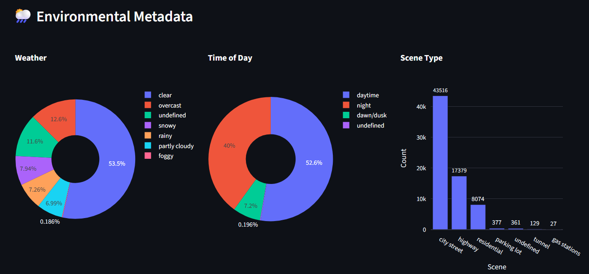

The BDD100K dataset excels in its diverse environmental priors, capturing the true complexity of ADAS deployment:

* **Time of Day:** Uniquely, **40% of the data is captured at night**. This is a massive advantage over older datasets like KITTI (which are predominantly daytime). However, night-time bounding boxes often rely on headlight illumination, causing unique glare and contrast artifacts.
* **Weather:** While 53.5% of the data is under `clear` conditions, there is a healthy representation of `overcast` (12.6%), `rainy` (7.26%), and `snowy` (7.94%) conditions.
* **Scene Type:** Heavily skewed towards `city street` (43.5k) and `highway` (17k). 

**Engineering Insight:**
The high variance in illumination (day vs. night) means the perception model must heavily rely on structural features rather than purely color/texture. Strong photometric augmentations (random gamma, brightness, and contrast shifts) should be applied. Stratified splits based on these environmental tags should be verified to ensure the validation set matches this distribution.

---

## 4. Class-Level Metrics & Geometry

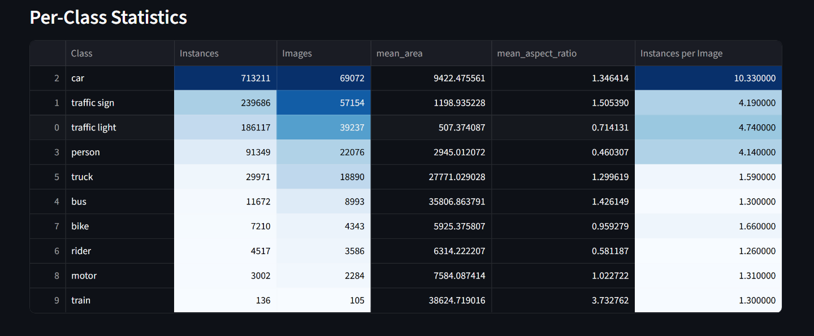

| Class | Instances | Images | Mean Area (px²) | Mean Aspect Ratio (w/h) | Instances / Image |
| :--- | :--- | :--- | :--- | :--- | :--- |
| **car** | 713,211 | 69,072 | 9,422 | 1.34 | 10.33 |
| **traffic sign** | 239,686 | 57,154 | 1,198 | 1.50 | 4.19 |
| **traffic light** | 186,117 | 39,237 | 507 | 0.71 | 4.74 |
| **person** | 91,349 | 22,076 | 2,945 | 0.46 | 4.14 |
| **truck** | 29,971 | 18,890 | 27,771 | 1.29 | 1.59 |
| **bus** | 11,672 | 8,993 | 35,806 | 1.42 | 1.30 |
| **bike** | 7,210 | 4,343 | 5,925 | 0.95 | 1.66 |
| **rider** | 4,517 | 3,586 | 6,314 | 0.58 | 1.26 |
| **motor** | 3,002 | 2,284 | 7,584 | 1.02 | 1.31 |
| **train** | 136 | 105 | 38,624 | 3.73 | 1.30 |

**Observations:**
* **Density:** Cars are ubiquitous, appearing in nearly every image (69,072 out of 69,863) with over 10 instances per frame on average.
* **Aspect Ratios:** Vulnerable Road Users (VRUs) like `person` and `rider` have tall, narrow aspect ratios (~0.46 - 0.58), whereas `car`, `truck`, and `bus` are wider (> 1.2). 

---

## 5. Object Scale & Size Distribution

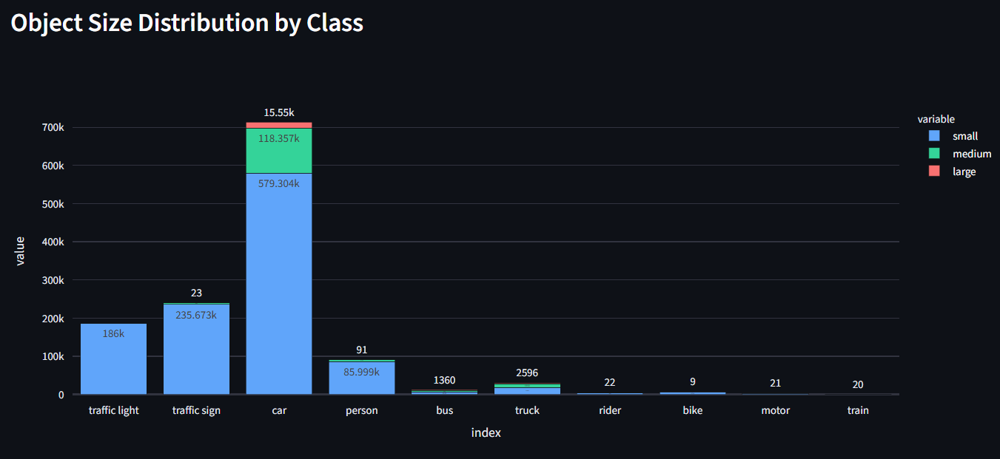

This is perhaps the most critical finding for architecture design: **The dataset is overwhelmingly composed of small objects.**
* For `car`, nearly 580k instances are categorized as small, compared to only ~118k medium and ~15k large.
* `traffic light` and `traffic sign` classes are almost exclusively small objects.

**Engineering Insight:**
If utilizing an anchor-based detector (e.g., Faster R-CNN, YOLO variants), the anchor clustering algorithm (like K-Means) must be run specifically on this dataset to generate appropriately tiny anchor scales. Relying on COCO pre-trained anchors will yield poor IoU assignments during training. Furthermore, the architecture should prioritize feature fusion mechanisms like PANet or BiFPN to pass high-resolution semantic information to the lower prediction heads.

---

## 6. Spatial & Geometric Priors

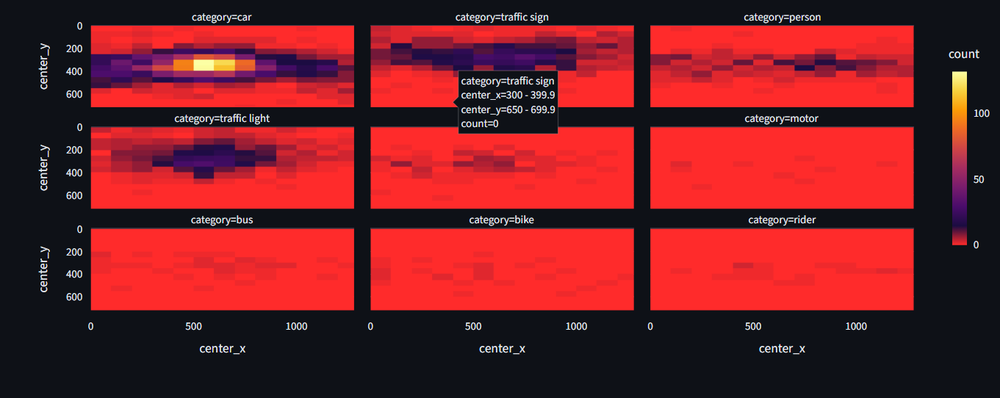
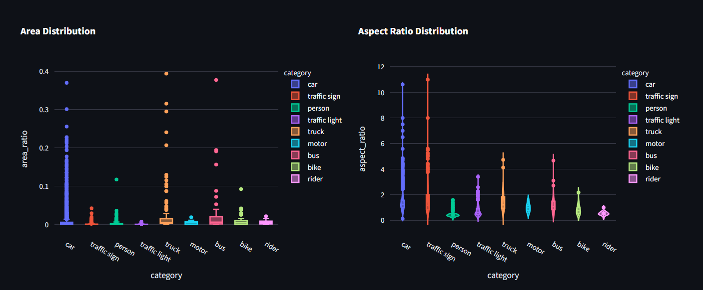

**Spatial Heatmaps:**
* **Ego-Vehicle Perspective:** The 2D spatial density plots clearly reflect the fixed perspective of a forward-facing ADAS camera. 
* **Ground Plane Constraints:** Vehicles (`car`, `truck`, `bus`) are highly concentrated along the vanishing point/horizon line (around `center_y = 350-400`). 
* **Overhead Infrastructure:** `traffic light` and `traffic sign` instances are heavily biased toward the upper half of the image.

**Aspect Ratio & Area Anomalies:**
* The violin plots show significant long-tail outliers in aspect ratios, particularly for cars and traffic signs. Some of these (e.g., width/height > 10) are likely occlusion artifacts, truncated boxes at the image boundaries, or labeling errors.

**Engineering Insight:**
1. **Spatial Pruning:** We can leverage these spatial priors as a post-processing heuristic. For instance, a high-confidence "traffic light" prediction near the bottom edge of the frame (`center_y > 600`) has a high probability of being a false positive (e.g., a vehicle's tail light reflection) and its confidence score can be penalized.
2. **Box Regression Limits:** Bounding box regression targets should be clipped or normalized to prevent gradients from exploding on extreme aspect ratio outliers shown in the rightmost chart.

---

## 7. Object Co-occurrence Analysis

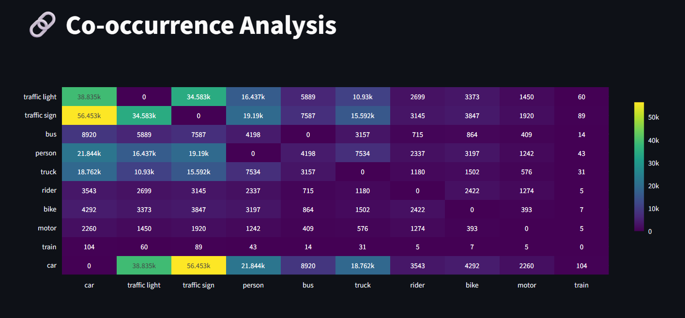

Understanding which objects frequently appear together provides crucial context for scene understanding and can be leveraged to improve detection performance through contextual priors.

**Key Observations:**
* **The "Urban Core" Cluster:** The highest co-occurrences form a distinct triad: `car`, `traffic sign`, and `traffic light`. 
    * `car` and `traffic sign` co-occur most frequently (56.4k instances).
    * `car` and `traffic light` co-occur 38.8k times.
    * `traffic light` and `traffic sign` co-occur 34.5k times.
* **Vulnerable Road User (VRU) Context:** `person` boxes heavily co-occur with `car` (21.8k) and `traffic sign` (19.1k), which is expected in urban driving scenarios (e.g., pedestrians near crosswalks and intersections).
* **Sparse Relationships:** As expected from the class distribution tail, classes like `train`, `rider`, and `motor` have very low co-occurrence rates with most other objects.

**Engineering Insight:**
We can use this co-occurrence matrix to design a **contextual post-processing step or a Graph Convolutional Network (GCN) head**. For instance, if the model predicts a `traffic light` with low confidence, but strongly detects multiple `cars` and `traffic signs` in the same frame, the prior probability of the `traffic light` being a true positive increases. Conversely, a high-confidence `train` prediction in a frame entirely dominated by dense `bike` and `person` predictions (typical of a tight city street) might warrant a second look or a confidence penalty.

---

## 8. Train vs. Validation Split Consistency (Drift Analytics)

A robust validation set must accurately mirror the training distribution to ensure reliable performance estimates. I analyzed the distribution drift across classes, scenes, and weather conditions.

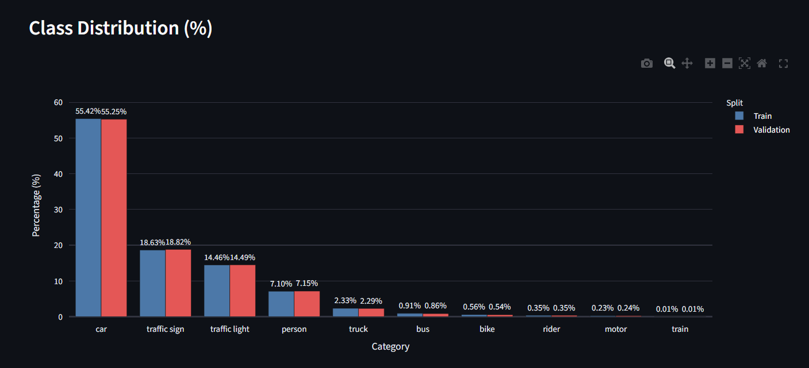
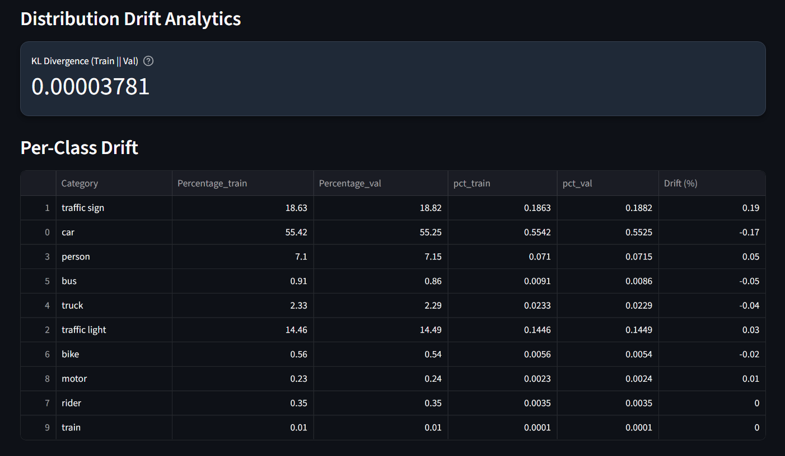

**Class Distribution Drift:**
* The KL Divergence between the train and validation class distributions is **0.00003781**, an exceptionally low value indicating near-perfect alignment.
* The per-class drift table confirms this: the largest deviation is for `car` (-0.17%) and `traffic sign` (+0.19%). 

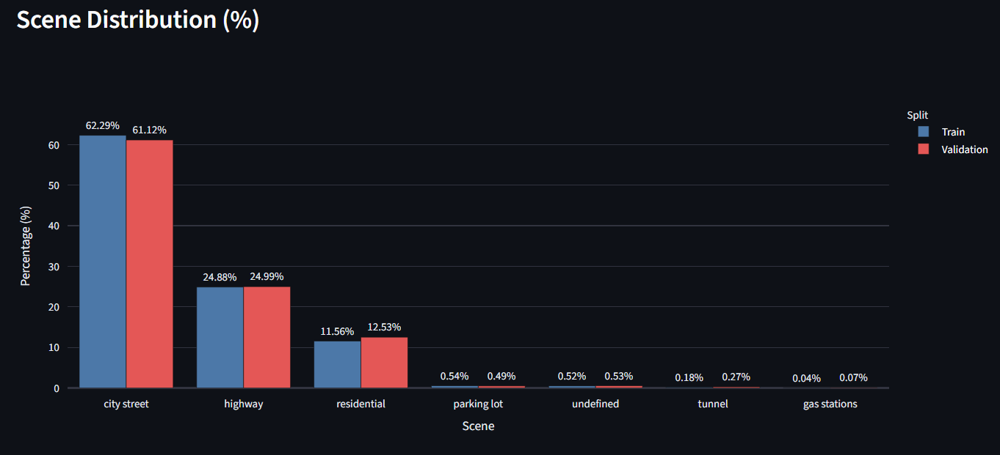
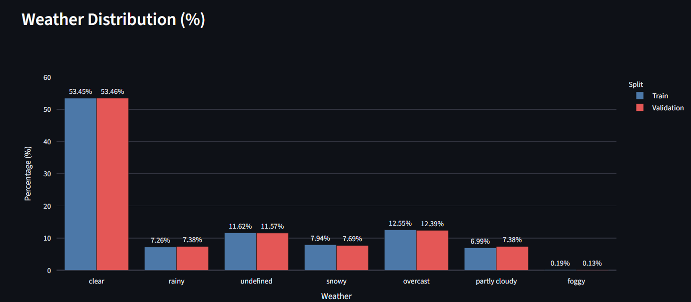

**Environmental Drift:**
* **Scene Types:** Both splits are heavily dominated by `city street` (~61-62%) and `highway` (~25%). The variation between splits is negligible (typically < 1%).
* **Weather:** The representation of weather conditions is highly consistent. `clear` conditions dominate (~53.5%), with strong matching percentages for `overcast`, `undefined`, and `snowy` conditions across both sets.

**Engineering Insight:**
The dataset creators have done an excellent job stratifying the train/val splits. We can be highly confident that performance improvements on the validation set will correlate directly with improvements on the training distribution. No synthetic re-balancing or specialized sampling is required for the validation set.

---

## 9. Anomalies, Edge Cases, and Label Noise

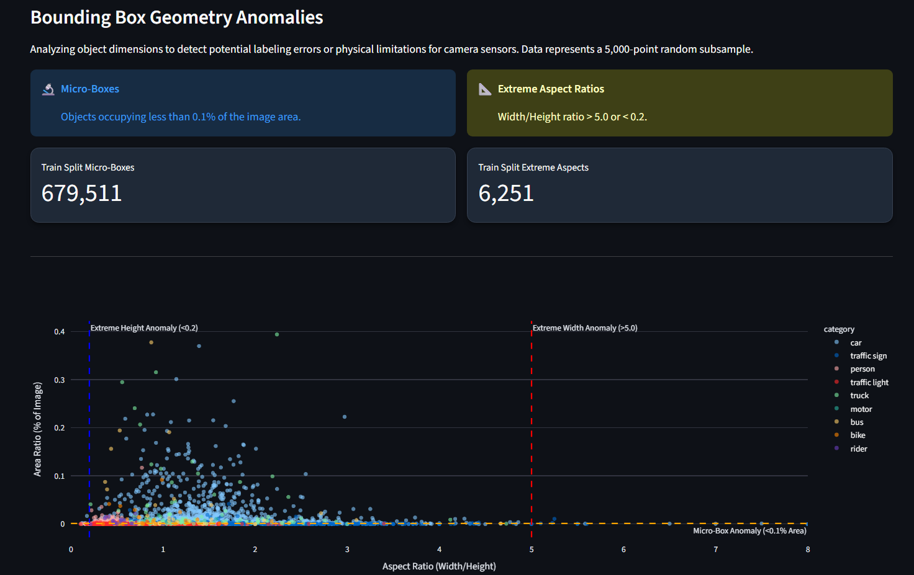

Analyzing the bounding box geometry reveals physical extremes that can severely impact model training and establish lower bounds for sensor resolution requirements.

**Micro-Boxes:**
* A staggering **679,511 bounding boxes** (over 50% of the dataset's annotations) occupy less than 0.1% of the total image area. 
* This reinforces the "Small Object Problem" identified earlier, but pushes it to an extreme. At 720p resolution, an object taking up 0.1% of the area is roughly 30x30 pixels. 

**Extreme Aspect Ratios:**
* There are **6,251 instances** with extreme aspect ratios (Width/Height > 5.0 or < 0.2).
* The scatter plot reveals that these extreme ratios are predominantly found in `car` and `truck` classes (likely long trailers viewed from the side, or heavily truncated vehicles at the image edges) and `person`/`rider` classes (likely highly occluded pedestrians where only a thin vertical slice is visible).

**Engineering Insight:**
1. **Micro-Box Strategy:** For objects smaller than 10x10 pixels, bounding box regression becomes highly unstable due to quantization errors in feature maps. We must evaluate whether these "micro-boxes" represent actionable ADAS targets. If a car is 15 pixels wide, it is likely hundreds of meters away and beyond the immediate planning horizon. We may need to implement a **minimum area threshold** (e.g., ignore boxes < 100 px²) during training to prevent the loss function from being overwhelmed by noise.
2. **Extreme Ratio Handling:** Bounding boxes with aspect ratios > 5.0 are often the result of heavy occlusion (e.g., seeing only the roof of a car over a barrier). These samples should be visualized directly. If they are heavily occluded, they might confuse the model's appearance priors. We should consider utilizing RoI Align rather than standard RoI Pooling to better handle these extreme shapes, and potentially employ GIoU or DIoU loss, which are more robust to aspect ratio variations than standard IoU.

## 10. Qualitative Edge Case Analysis (Visualizing Extremes)

While statistical distributions highlight dataset-wide trends, visualizing extreme edge cases is critical for anticipating failure modes in deployment. Based on the dashboard's hard-sample explorer, I have isolated three categories of severe edge cases that will test the limits of our perception stack.

### 10.1 The Limit of Resolution: Micro-Objects
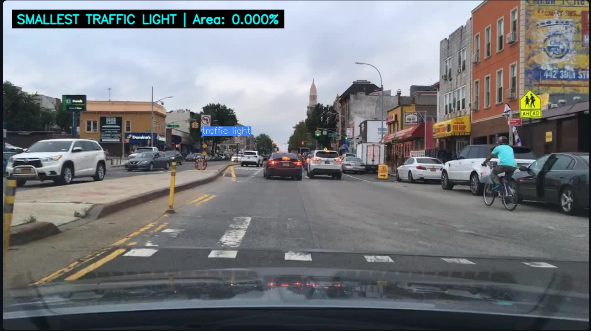

**Observation:** The image above demonstrates a `traffic light` occupying mathematically **0.000% of the image area** (sub-pixel or single-pixel scale after rounding). 

**Engineering Impact:**
* **Feature Map Degradation:** Standard backbone networks (like ResNet) utilize stride-32 downsampling. By the time the image reaches the deeper layers (e.g., C5), a 4x4 pixel object in the input image is reduced to less than a single pixel, completely losing its spatial semantic features.
* **Quantization Error:** Bounding box regression on objects this small is highly chaotic. A 1-pixel jitter in the prediction translates to a massive IoU drop.
* **Mitigation Strategy:** We must implement a "Do Not Care" (ignore) region strategy during the loss calculation for objects below a certain pixel threshold (e.g., < 15x15 pixels). Forcing the model to learn these will only introduce noisy gradients. Alternatively, heavy reliance on the highest-resolution feature pyramid levels (P2/P3) is required if these must be detected.

### 10.2 Cognitive Overload: High-Density Scenes
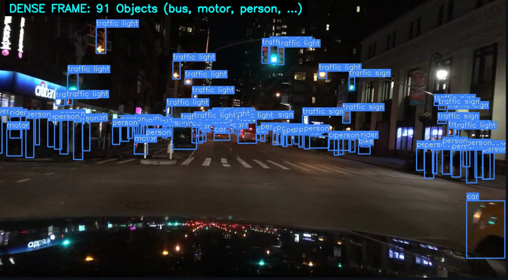
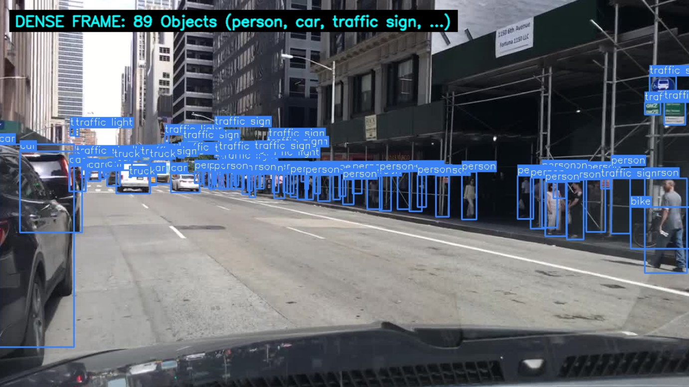

**Observation:**
These frames contain ~90 objects per image, packed tightly into the field of view. We see massive overlapping of `person`, `car`, and `traffic sign` bounding boxes. Furthermore, the night scene introduces extreme contrast, headlight glare, and motion blur.

**Engineering Impact:**
* **NMS Bottleneck:** Dense crowds are the primary failure point for traditional Non-Maximum Suppression (NMS). If a pedestrian is partially occluding another, standard NMS is highly likely to suppress the bounding box of the occluded pedestrian (a false negative), which is catastrophic for ADAS.
* **Mitigation Strategy:** 1.  **Soft-NMS or DIoU-NMS:** Replace standard greedy NMS with Soft-NMS or distance-IoU NMS, which decays confidence scores based on distance rather than applying a hard threshold, preserving heavily overlapping instances.
    2.  **Transformer Decoders:** If utilizing a DETR-like architecture, bipartite matching completely bypasses the need for NMS and handles dense crowds significantly better.
    3.  **Night-time Augmentation:** Apply localized glare and histogram equalization augmentations to simulate the extreme lighting conditions seen in `high_density_1`.

### 10.3 Macro-Objects and Truncation
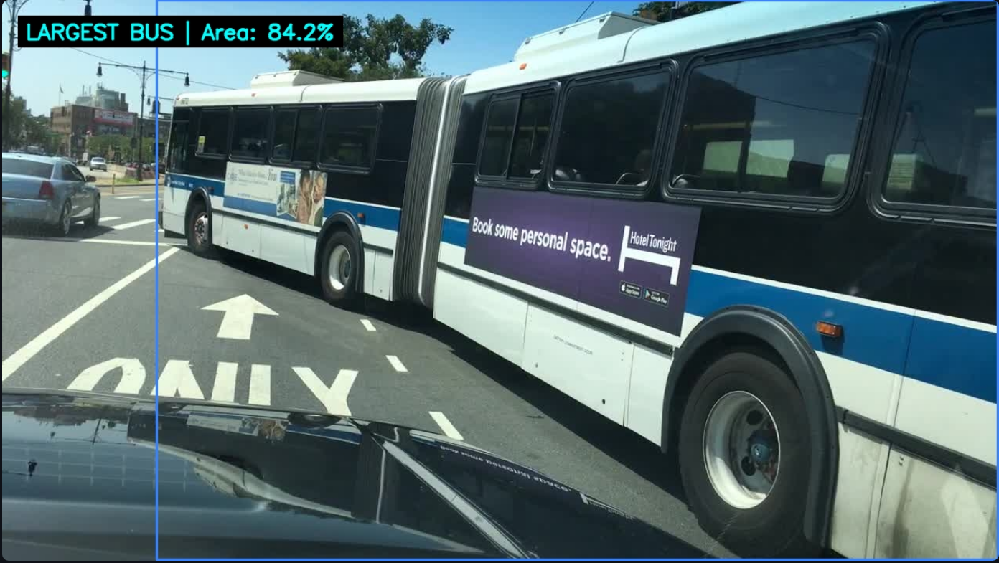
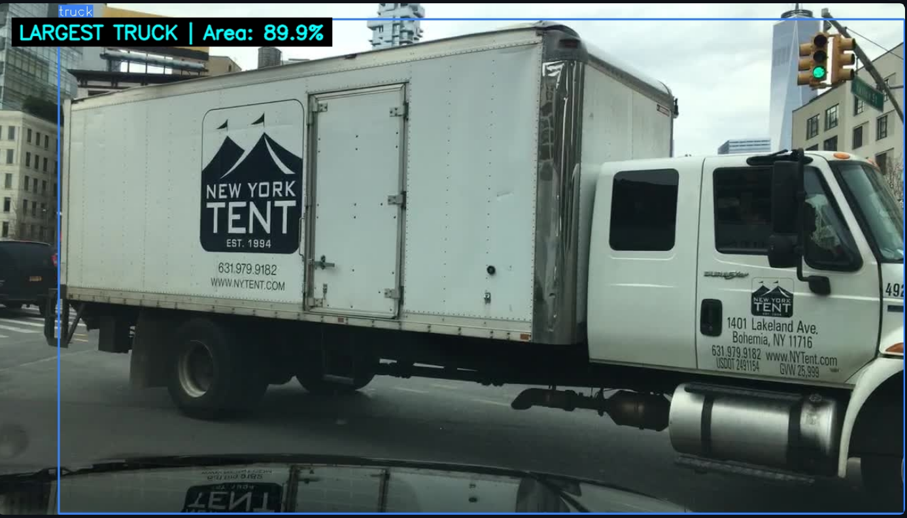

**Observation:**
In these frames, a `bus` and a `truck` occupy roughly **85% to 90% of the entire image**. The vehicles are heavily truncated, extending well beyond the camera's framing.

**Engineering Impact:**
* **Receptive Field Limitations:** If the model's effective receptive field is smaller than the object, it might classify parts of the bus (like the wheels or windows) as separate entities, failing to recognize the global context of the vehicle.
* **Anchor Box Out-of-Bounds:** During training, targets that heavily breach the image boundaries can cause unstable loss calculations if not properly clipped.
* **Mitigation Strategy:** 1.  Ensure bounding box regression targets are strictly clipped to the `[0, width]` and `[0, height]` bounds before computing loss.
    2.  Utilize spatial attention mechanisms (like self-attention layers or large-kernel convolutions) to ensure the network can aggregate global context across the entire feature map to classify these massive, truncated objects correctly.

---

## 11. Final Conclusion & Strategic Recommendations

The exploratory data analysis of the BDD100K object detection subset confirms that it is a highly realistic, challenging, and production-grade dataset. It accurately captures the chaotic and unconstrained nature of real-world urban driving, moving far beyond the curated nature of traditional benchmark datasets. 

However, the dataset's fidelity to the real world means it is inherently imbalanced. To successfully train a robust ADAS perception model on this data, we cannot rely on off-the-shelf architectures with default hyperparameters. The perception pipeline must be deliberately engineered to address the specific inductive biases present in the data.

Based on this analysis, I recommend the following strategic implementations for the model architecture and training pipeline:

### 1. Architectural Adjustments
* **High-Resolution Feature Fusion:** Given that over 50% of the dataset consists of "micro-boxes," standard backbones will lose these targets due to downsampling. The architecture must incorporate advanced feature pyramids (e.g., BiFPN or PANet) to retain high-resolution spatial features from early layers (P2/P3).
* **Crowd-Aware Processing:** To handle the extreme density of urban centers (~90 objects per frame), standard greedy NMS will result in catastrophic false negatives for occluded pedestrians. The model should employ **Soft-NMS, DIoU-NMS**, or transition to a bipartite-matching Transformer architecture (like DETR) to bypass NMS bottlenecks entirely.
* **Aspect Ratio Calibration:** Anchor-based models will require custom K-Means clustering on this specific dataset to generate anchors that accommodate the extreme aspect ratios of truncated vehicles and tall pedestrians. 

### 2. Training & Loss Formulation
* **Data Balancing is Mandatory:** Due to the extreme long-tail distribution heavily skewed towards `car` and `traffic sign` classes, standard training will result in a heavily biased model. **It is very much required to apply rigorous data balancing methods** to ensure the network learns edge-case classes like `train`, `rider`, and `motor`. This should be tackled through multiple methods:
    * **Data-Level Balancing:** Implement Class-Aware Sampling, Repeat Factor Sampling (RFS), or specialized copy-paste augmentations to artificially boost the frequency of tail classes within training batches.
    * **Algorithmic-Level Balancing:** Standard Cross-Entropy loss will ignore minority classes. Replacing it with **Focal Loss** or a dynamic Class-Balanced Loss formulation is non-negotiable.
* **Target Filtering:** Bounding boxes occupying less than a defined micro-threshold (e.g., < 15x15 pixels) should be masked out or assigned a "Do Not Care" label during loss computation to prevent severe quantization errors and noisy gradient updates.

### 3. Data Augmentation & Domain Adaptation
* **Photometric Robustness:** With 40% of the data captured at night and a significant portion under adverse weather (snow, rain, fog), the model is highly susceptible to domain shift. Aggressive photometric augmentations (random gamma, contrast, localized glare simulation, and CutMix/Mosaic) should be applied to force the model to learn structural rather than purely textural features.

**Final Verdict:** The Train/Validation splits are exceptionally well-stratified, meaning our validation metrics will be highly reliable indicators of true model performance. By addressing the small-object problem, enforcing strict data balancing methods, and designing for extreme scene density, we can leverage this dataset to build a highly capable and safe autonomous perception stack.

