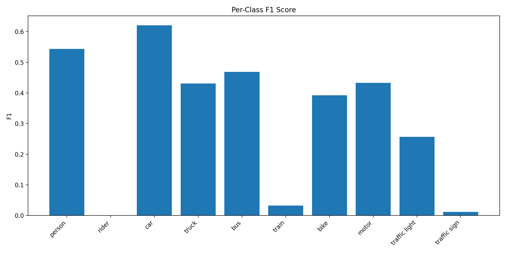
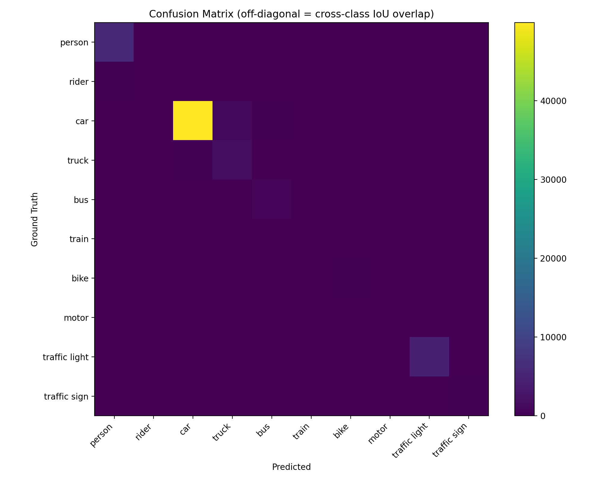
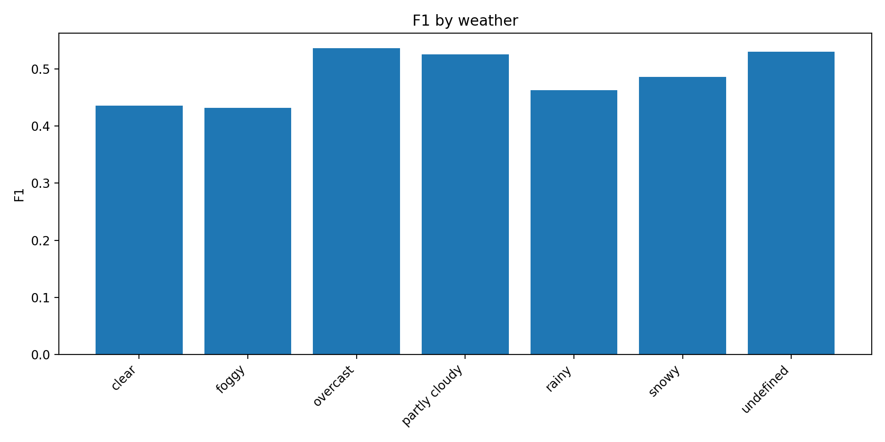
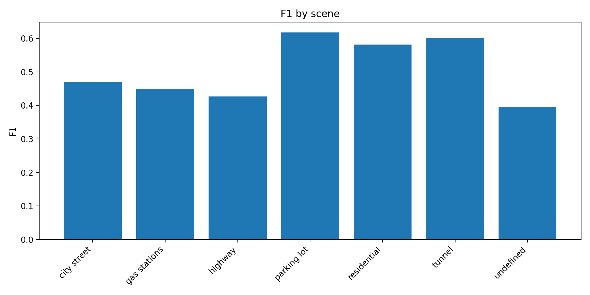
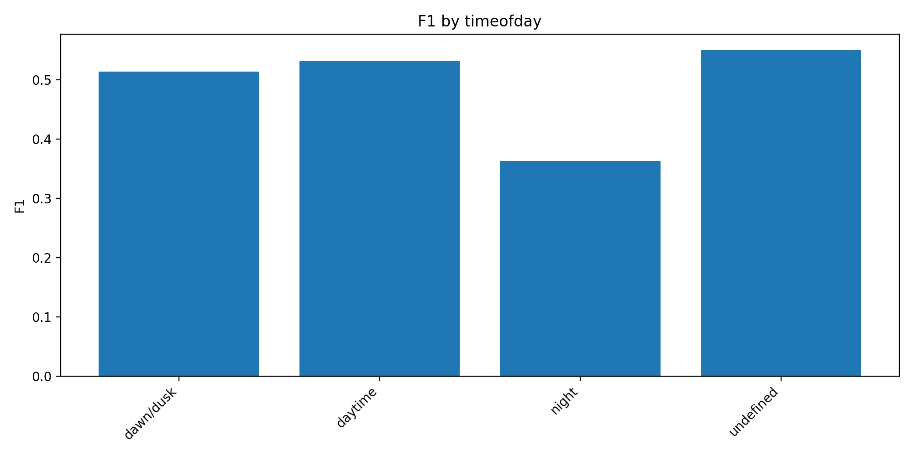
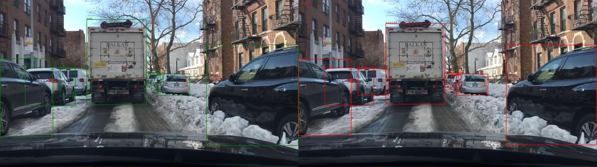
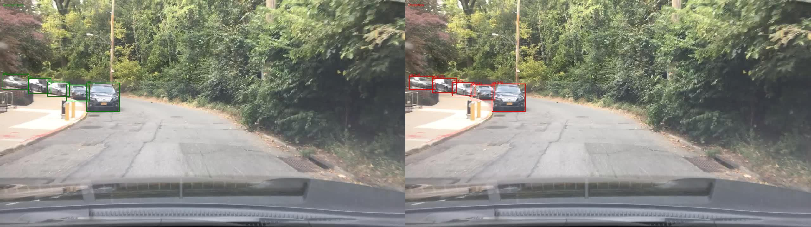
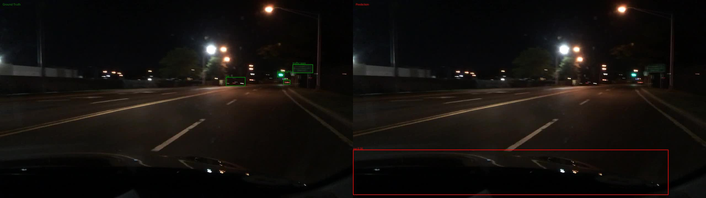
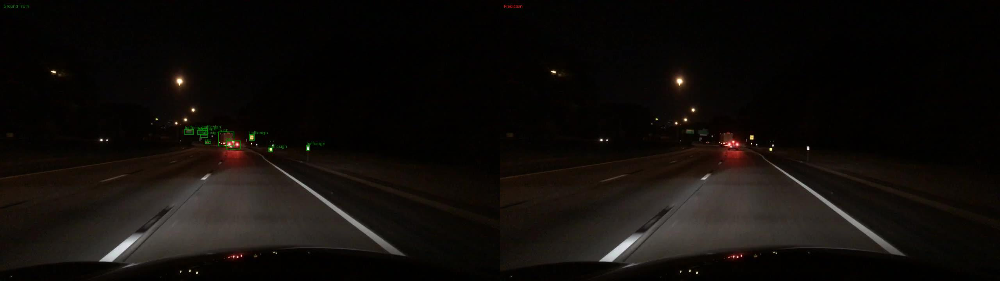

# Model Evaluation and Visualization

## Overview

This section evaluates the performance of the pretrained **YOLO11m** object detection model on the **BDD100K validation dataset**. The objective is to quantify model performance, analyze failure cases, visualize prediction quality, and identify potential improvements.

The evaluation combines both **quantitative** and **qualitative** analysis.

---

# Evaluation Setup

| Parameter | Value |
|------------|--------|
| Model | YOLO11m |
| Dataset | BDD100K Validation Set |
| Images Evaluated | 10,000 |
| IoU Threshold | 0.50 |
| Confidence Threshold | 0.45 |

A prediction is considered correct when:

- Predicted class matches the ground truth class.
- IoU ≥ 0.50.

Class-aware matching was used during evaluation to avoid incorrect cross-class assignments.

---

# Quantitative Evaluation

## Selected Metrics

The following metrics were chosen because they provide a comprehensive assessment of object detection performance.

### Precision

Measures how many predicted objects are correct.

Precision = TP / (TP + FP)

High precision reduces false alarms, which is important in ADAS systems.

### Recall

Measures how many real objects are successfully detected.

Recall = TP / (TP + FN) (where TP = true positives, FN = false negatives)

High recall is critical for safety because missed objects can lead to dangerous situations.

### F1 Score

Balances precision and recall.

$$
F1 = \frac{2 \times \text{Precision} \times \text{Recall}}{\text{Precision} + \text{Recall}}
$$

F1 Score was selected because both false positives and false negatives are important in autonomous driving applications.

---

# Overall Performance

| Metric | Score |
|----------|----------|
| Micro Precision | **0.7921** |
| Micro Recall | **0.3400** |
| Micro F1 | **0.4758** |
| Macro Precision | **0.5504** |
| Macro Recall | **0.2680** |
| Macro F1 | **0.3192** |

## Analysis

The model achieves a relatively high precision of **79.21%**, indicating that most detections are correct.

However, recall is only **34.00%**, meaning a large number of objects are missed.

The significant gap between precision and recall suggests that the model is conservative and prioritizes avoiding false positives over detecting all objects.

The lower Macro F1 score compared to Micro F1 indicates uneven performance across classes, especially for minority classes.

---

# Per-Class Performance

| Class | F1 Score |
|---------|---------|
| Person | 0.54 |
| Rider | 0.00 |
| Car | 0.62 |
| Truck | 0.43 |
| Bus | 0.47 |
| Train | 0.03 |
| Bike | 0.39 |
| Motor | 0.43 |
| Traffic Light | 0.26 |
| Traffic Sign | 0.01 |



## Analysis

### Best Performing Class: Car

**F1 = 0.62**

Reasons:

- Large object size
- High frequency in training data
- Strong representation in COCO pretraining

### Strong Classes

- Person (0.54)
- Bus (0.47)
- Truck (0.43)
- Motor (0.43)

These objects are generally large and visually distinctive.

### Weak Classes

#### Rider (0.00)

The model completely fails to detect riders.

Reason:

The pretrained COCO model does not contain a rider category.

#### Traffic Sign (0.01)

Traffic signs are almost never detected correctly.

Reasons:

- Extremely small object size
- High appearance variation
- COCO only contains stop-sign annotations

#### Train (0.03)

Poor performance is likely caused by low class frequency and limited training examples.

#### Traffic Light (0.26)

Traffic lights are small and often appear far from the camera, making detection difficult.

---

# Confusion Matrix Analysis



The confusion matrix indicates that:

- Most successful detections lie on the diagonal.
- Rider objects are almost entirely missed.
- Traffic sign detections are extremely limited.
- Most errors originate from missed detections rather than incorrect class assignments.

This observation aligns with the low recall score obtained during evaluation.

---

# Environmental Attribute Analysis

The evaluation pipeline also analyzes performance under different environmental conditions.

---

## Weather Analysis

| Weather | F1 Score |
|----------|----------|
| Clear | 0.44 |
| Foggy | 0.43 |
| Rainy | 0.46 |
| Snowy | 0.49 |
| Partly Cloudy | 0.52 |
| Overcast | 0.54 |



### Observations

Best Weather Condition:

- Overcast (0.54)

Worst Weather Condition:

- Foggy (0.43)

Fog significantly reduces visibility and object contrast, resulting in lower detection performance.

---

## Scene Analysis

| Scene | F1 Score |
|----------|----------|
| City Street | 0.47 |
| Gas Station | 0.45 |
| Highway | 0.43 |
| Parking Lot | 0.62 |
| Residential | 0.58 |
| Tunnel | 0.60 |



### Observations

Best Scene:

- Parking Lot (0.62)

Worst Scene:

- Highway (0.43)

Highway scenes contain many distant vehicles, resulting in smaller bounding boxes and reduced detection accuracy.

---

## Time-of-Day Analysis

| Time of Day | F1 Score |
|-------------|----------|
| Daytime | 0.53 |
| Dawn/Dusk | 0.51 |
| Night | 0.36 |



### Observations

Night-time scenes show the largest performance degradation.

Compared with daytime conditions, night scenes suffer from:

- Reduced illumination
- Lower object contrast
- Motion blur
- Sensor noise
- Headlight glare

---

# Qualitative Analysis

Qualitative visualization was generated using side-by-side comparisons of:

- Ground Truth Bounding Boxes
- Predicted Bounding Boxes

Generated outputs:

```text
evaluation/qualitative/
evaluation/best_cases/
evaluation/failure_cases/
```


---

## Best Cases

Common characteristics of successful detections:

- Good lighting
- Large objects
- Minimal occlusion
- Clear object boundaries



The model performs very well under these conditions.

---

## Failure Cases

The following recurring failure patterns were identified.




### Small Object Detection

Affected Classes:

- Traffic Sign
- Traffic Light

Small objects occupy only a few pixels and are therefore difficult to detect.

### Rider Detection Failure

Affected Class:

- Rider

Since the COCO-pretrained model lacks a rider category, rider instances become systematic false negatives.

### Night-Time Scenes

Night scenes achieved the lowest F1 score (**0.36**).

Primary causes:

- Low illumination
- Motion blur
- Sensor noise
- Headlight reflections

### Long-Range Objects

Objects located far from the ego vehicle frequently go undetected because their bounding boxes become extremely small.

### Crowded Urban Scenes

Urban environments generate:

- Increased occlusion
- Object overlap
- Localization errors

leading to higher false-negative rates.

---

# Relationship with Dataset Analysis

The evaluation results strongly align with observations from the exploratory data analysis.

The dataset analysis identified:

- Significant class imbalance
- Large variation in object sizes
- High frequency of small traffic signs
- Challenging night-time conditions

The weakest-performing classes correspond directly to the classes identified as difficult during data exploration.

This demonstrates a strong relationship between dataset characteristics and model performance.

---

# Recommendations

## Data Improvements

### Increase Small Object Samples

Focus on:

- Traffic Signs
- Traffic Lights
- Distant Pedestrians

### Address Class Imbalance

Possible approaches:

- Oversampling
- Weighted loss functions
- Focal Loss

### Night-Time Augmentation

Introduce:

- Brightness augmentation
- Contrast augmentation
- Weather augmentation

---

## Model Improvements

### Fine-Tune on BDD100K

Training directly on BDD100K annotations would improve:

- Rider detection
- Traffic sign detection
- Domain adaptation

### Higher Resolution Training

Increasing input resolution can improve small-object detection.

### Multi-Scale Feature Learning

Feature Pyramid Networks (FPN) or transformer-based detectors can improve detection across different object scales.

### Threshold Optimization

Optimize confidence and IoU thresholds to improve recall while maintaining acceptable precision.

---

# Conclusion

YOLO11m demonstrates strong precision (**79.21%**) but relatively low recall (**34.00%**) on the BDD100K validation dataset.

The model performs best on large and common object categories such as cars, buses, and trucks. However, performance degrades significantly for:

- Riders
- Traffic Signs
- Traffic Lights
- Night-Time Scenes
- Long-Range Objects

The analysis shows that most failures are caused by missed detections rather than incorrect classifications.

Future improvements should focus on:

1. Fine-tuning on BDD100K.
2. Improving small-object detection.
3. Addressing class imbalance.
4. Enhancing night-time robustness.

These improvements would substantially increase perception reliability for ADAS applications.