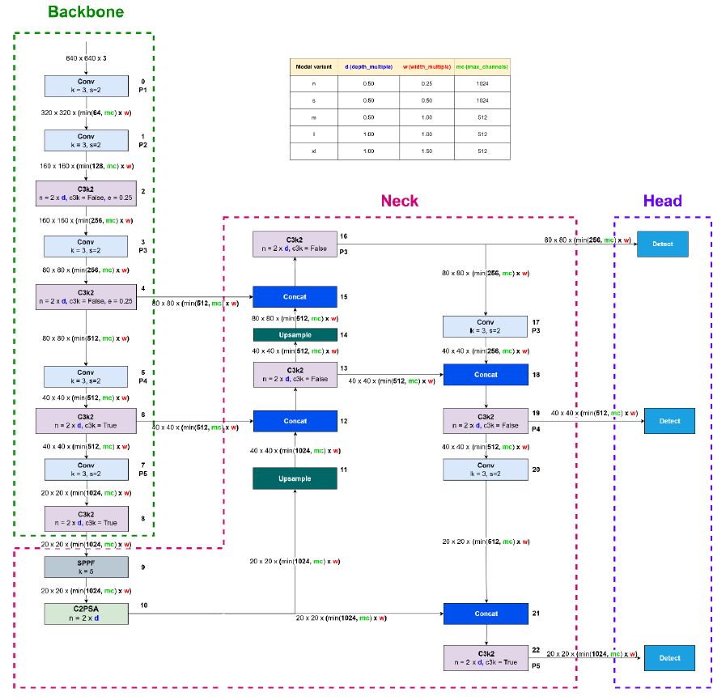
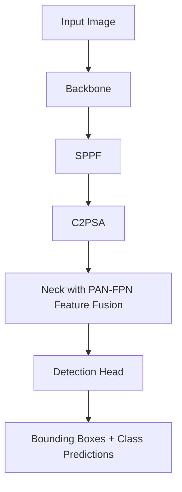
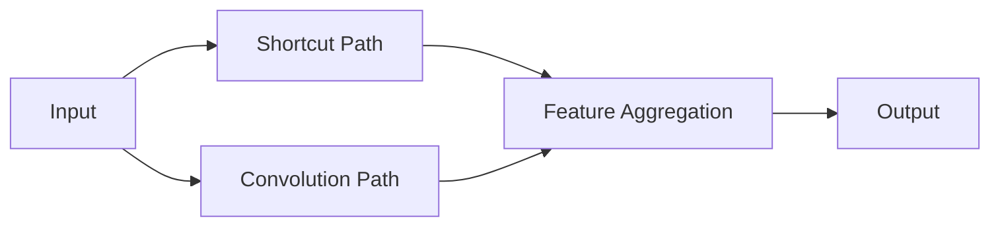
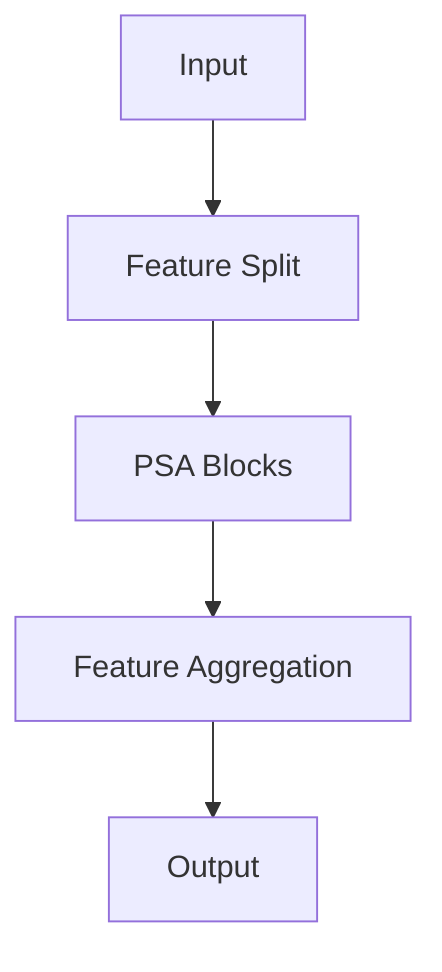

# Model Selection and Architecture Analysis


Since the dataset represents real-world driving environments, the selected detector must satisfy the following requirements:

* High detection accuracy across diverse traffic scenarios
* Robust detection of small and distant road users
* Real-time inference capability
* Scalability to embedded deployment platforms
* Strong performance under varying weather and lighting conditions
* Compatibility with modern automotive perception workflows

After evaluating several modern object detection architectures, **YOLO11m** was selected.

---

## Why YOLO11m?

The exploratory analysis of BDD100K revealed several challenges that directly influence detector selection:

- Significant class imbalance with a pronounced long-tail distribution
- Large variation in object scale
- Small and distant traffic lights and traffic signs
- Dense urban scenes containing multiple overlapping vehicles
- Diverse lighting and weather conditions
- Real-time processing requirements for ADAS deployment

These characteristics require a detector that can simultaneously:

1. Maintain strong multi-scale feature representations
2. Detect small objects reliably
3. Operate with low inference latency
4. Scale efficiently to embedded hardware

YOLO11m provides the best balance between these competing requirements. While larger architectures may offer marginal accuracy improvements, they introduce significant computational overhead with limited practical benefit for this dataset and assignment scope.

---

# Comparison Against Alternative Architectures

## Faster R-CNN

### Advantages

* High localization accuracy
* Well-established architecture
* Strong benchmark performance

### Limitations

* Two-stage detection pipeline
* Higher computational cost
* Increased inference latency
* Not ideal for real-time deployment

Since ADAS systems require real-time performance, Faster R-CNN was not selected.

---

## RT-DETR

### Advantages

- Global contextual reasoning through transformer attention
- Strong localization performance
- End-to-end object detection framework

### Limitations

- Higher computational complexity
- Increased memory requirements
- Longer training and inference times
- More demanding deployment pipeline

### Engineering Decision

RT-DETR is an attractive candidate for offline benchmark optimization. However, the objective of this project is to demonstrate an end-to-end automotive perception workflow with practical deployment considerations. Given the real-time constraints common in ADAS systems, YOLO11m provides a more favorable accuracy-latency trade-off.

---

## YOLOv8

### Advantages

* Excellent speed
* Strong industrial adoption
* Mature deployment ecosystem

### Limitations

* Earlier generation architecture
* Lower efficiency compared to newer YOLO versions
* Less optimized feature aggregation

YOLO11 introduces several architectural improvements that improve both efficiency and accuracy.

---

## YOLO11m (Selected)

### Advantages

* Excellent accuracy-to-speed ratio
* Single-stage architecture
* Efficient feature fusion
* Improved backbone and neck design
* Optimized for edge deployment
* Mature deployment support (TensorRT, ONNX, OpenVINO)
* Strong small-object detection capability
* Lower latency than transformer-based detectors

These characteristics make YOLO11m highly suitable for automotive perception systems where both accuracy and real-time performance are essential.

| Metric / Feature | Faster R-CNN | RT-DETR | YOLOv8 | YOLO11m (Selected) |
|-----------------|-------------|----------|---------|--------------------|
| Architecture Type | Two-Stage CNN | Transformer | One-Stage CNN | One-Stage CNN |
| Real-Time Capability | Low | Moderate | High | Very High |
| Deployment Complexity | High | High | Low | Low |
| Embedded Suitability | Moderate | Moderate | High | Very High |
| Small Object Detection | High | High | Moderate | High |
| Latency | High | Moderate | Low | Very Low |
| Automotive Readiness | Moderate | Moderate | High | Very High |

---

# Selection of YOLO11m

The YOLO11m variant was selected for this assignment.

Reasons:

1. Strong balance between accuracy and computational efficiency
2. Better representation capacity than YOLO11n and YOLO11s
3. Lower computational requirements than YOLO11l and YOLO11x
4. Suitable for training on commodity GPUs
5. Real-time deployment capability on embedded platforms
6. Strong performance for automotive object detection tasks

The assignment focuses on:

* Dataset understanding
* Engineering workflow
* Data analysis
* Model development
* Evaluation methodology
* Visualization

rather than maximizing benchmark performance at any computational cost.

Therefore, YOLO11m provides an effective balance between performance and practicality.

---

# YOLO11m Architecture Deep Dive

YOLO11 represents the latest evolution of the Ultralytics YOLO family, introducing several architectural improvements over YOLOv8 and YOLOv10 while maintaining the real-time inference characteristics required for edge AI and autonomous driving applications.

The architecture follows the classic three-stage object detection pipeline:

1. **Backbone** – Feature Extraction
2. **Neck** – Multi-Scale Feature Fusion
3. **Detection Head** – Object Classification and Localization

---



---

# High-Level Design Philosophy

YOLO11 is designed around three major goals:

- Improved feature representation
- Better global context modeling
- Increased parameter efficiency

Compared to YOLOv8, YOLO11 introduces:

| Improvement | Purpose |
|------------|----------|
| C3k2 Block | More efficient feature extraction |
| C2PSA Module | Enhanced global attention |
| Improved Backbone Design | Better feature reuse |
| Lightweight Head | Faster deployment |
| Anchor-Free Detection | Simpler training and improved localization |

These improvements allow YOLO11 to achieve higher accuracy while maintaining real-time inference performance.

---

# Architecture Overview




---

# Stage 1: Backbone Network

The backbone is responsible for transforming raw pixel information into rich hierarchical feature representations.

Its primary objectives are:

- Edge extraction
- Texture extraction
- Shape representation
- Semantic understanding
- Context learning

As information flows deeper through the network, spatial resolution decreases while semantic richness increases.

---

## Backbone Structure

The YOLO11 backbone consists of:

### 1. Convolutional Stem

The input image first passes through two convolution layers.

Purpose:

- Initial feature extraction
- Spatial downsampling
- Noise suppression

Example:

Input:

640 × 640 × 3

After Stem:

320 × 320 × C

Then:

160 × 160 × C

---

## 2. C3k2 Feature Extraction Blocks

One of the most important innovations in YOLO11 is the introduction of the **C3k2 block**.

### Why Replace C2f?

YOLOv8 uses:

- C2f modules

YOLO11 replaces them with:

- C3k2 modules

Benefits:

- Lower parameter count
- Better feature reuse
- Improved gradient flow
- Enhanced receptive field

---

### Internal Structure of C3k2

The C3k2 module combines:

- CSP-style feature partitioning
- Residual bottlenecks
- Multiple kernel convolutions

The design allows:

- Shallow features
- Deep features
- Contextual features

to be learned simultaneously.

Conceptually:



---

### Why C3k2 Matters for ADAS

Road scenes contain:

- Small traffic lights
- Large trucks
- Distant pedestrians
- Occluded vehicles

C3k2 improves:

- Scale robustness
- Feature diversity
- Localization precision

making it particularly effective for autonomous driving datasets such as BDD100K.

---

## Multi-Scale Feature Extraction

The backbone progressively generates:

| Feature Level | Purpose |
|--------------|----------|
| P3 | Small Objects |
| P4 | Medium Objects |
| P5 | Large Objects |

Examples:

### P3 Features

Useful for:

- Traffic lights
- Traffic signs
- Riders

### P4 Features

Useful for:

- Cars
- Motorcycles
- Pedestrians

### P5 Features

Useful for:

- Trucks
- Buses
- Large nearby vehicles

---

# SPPF: Spatial Pyramid Pooling Fast

Before entering the neck, YOLO11 applies:

## SPPF (Spatial Pyramid Pooling Fast)

Purpose:

- Increase receptive field
- Capture contextual information
- Aggregate multi-scale spatial features

Without increasing feature map resolution.

---

## Why SPPF Helps

In road environments:

A pedestrian may occupy:

- 15 pixels at long distance
- 300 pixels at close range

SPPF enables the model to understand objects at multiple scales simultaneously.

Benefits:

- Better context awareness
- Improved distant object detection
- Increased robustness

---

# Stage 2: C2PSA Attention Module

The second major innovation in YOLO11 is:

## C2PSA (Cross Stage Partial Parallel Spatial Attention)

This module is inserted immediately after SPPF.

---

## Why Attention is Needed

Traditional convolution only sees local neighborhoods.

However, driving scenes contain long-range relationships.

Examples:

- Pedestrian crossing near traffic signal
- Vehicle emerging from behind a truck
- Traffic sign located far from ego vehicle

Attention enables the network to understand these global dependencies.

---

## C2PSA Architecture

C2PSA combines:

- CSP Feature Splitting
- Self-Attention
- Feed Forward Networks (FFN)

Workflow:



---

## Advantages of C2PSA

### Better Global Context

Understands relationships across the entire image.

### Improved Occlusion Handling

Useful in dense traffic.

### Stronger Feature Representation

Enhances semantic understanding.

### Efficient Computation

Applied only on low-resolution feature maps.

This keeps computational cost manageable while providing most of the benefits of self-attention.

---

# Stage 3: Neck (Feature Fusion Network)

The neck combines information from different backbone stages.

YOLO11 uses a PAN-FPN style feature aggregation architecture.

The objective is to merge:

- High-resolution localization features
- Deep semantic features

into a unified representation.

---

# Top-Down Feature Fusion

Deep features contain:

- Context
- Semantics
- Scene understanding

These features are upsampled and propagated toward higher-resolution layers.

Benefits:

- Improved small object detection
- Better scene understanding

Examples:

- Distant traffic lights
- Small pedestrians
- Far-away bicycles

---

# Bottom-Up Feature Aggregation

Shallow features contain:

- Fine details
- Object boundaries
- Localization cues

These are fused back into deeper layers.

Benefits:

- More precise bounding boxes
- Better separation of nearby objects

Examples:

- Dense urban traffic
- Crowded intersections
- Multiple overlapping vehicles

---

# Multi-Scale Detection Features

After feature fusion, YOLO11 produces:

| Layer | Resolution | Target Objects |
|---------|-------------|---------------|
| P3 | High Resolution | Small Objects |
| P4 | Medium Resolution | Medium Objects |
| P5 | Low Resolution | Large Objects |

This enables robust detection across a wide range of object scales.

---

# Stage 4: Detection Head

The detection head converts fused feature maps into final predictions.

YOLO11 uses an:

## Anchor-Free Detection Head

Unlike earlier YOLO versions:

- No anchor box generation
- No anchor tuning
- Simpler optimization

---

# Predictions Generated

For every detected object:

### 1. Bounding Box

Predicts:

- Center X
- Center Y
- Width
- Height

---

### 2. Objectness Score

Confidence that an object exists.

Example:

0.95 → Very likely object

0.20 → Likely background

---

### 3. Class Probability

Predicts category:

- Car
- Truck
- Bus
- Rider
- Traffic Light
- Traffic Sign

etc.

---

# Why Anchor-Free Detection?

Benefits include:

- Reduced complexity
- Faster convergence
- Better localization accuracy
- Easier deployment

Especially important for ADAS systems where precision and latency are critical.

---

# Architectural Advantages for BDD100K

BDD100K presents several real-world perception challenges.

YOLO11 directly addresses these challenges.

| BDD100K Challenge | YOLO11 Capability |
|------------------|-------------------|
| Small Traffic Lights | P3 Detection Layer |
| Distant Pedestrians | Multi-Scale Fusion |
| Dense Traffic | C2PSA Attention |
| Occluded Vehicles | Global Context Modeling |
| Night Driving | Rich Semantic Features |
| Large Scale Variation | PAN-FPN Fusion |
| Real-Time Constraints | Lightweight Architecture |

---

# Why YOLO11 is Well Suited for ADAS

ADAS perception systems require:

- High detection accuracy
- Low latency
- Edge deployment capability
- Robustness across environments

YOLO11 provides:

✓ Efficient feature extraction (C3k2)

✓ Global attention modeling (C2PSA)

✓ Multi-scale object detection

✓ Real-time inference

✓ Anchor-free localization

✓ Embedded deployment support

---

# Deployment Advantages

YOLO11 supports:

- TensorRT
- ONNX
- OpenVINO
- NVIDIA Jetson
- CUDA Acceleration
- Edge AI Accelerators

Common deployment targets include:

- Jetson Orin NX
- Jetson AGX Orin
- Xavier NX
- Automotive ECUs

---

# ADAS Applications

YOLO11 can serve as the perception backbone for:

- Forward Collision Warning (FCW)
- Automatic Emergency Braking (AEB)
- Blind Spot Detection (BSD)
- Traffic Sign Recognition (TSR)
- Lane Change Assist (LCA)
- Smart Turn Assist (STA)
- Surround View Monitoring
- Urban Perception Systems

---

# Key Architectural Innovations Summary

| Component | YOLOv8 | YOLO11 |
|------------|---------|---------|
| Feature Block | C2f | C3k2 |
| Attention | None | C2PSA |
| Context Modeling | Limited | Global |
| Parameter Efficiency | Good | Better |
| Small Object Detection | Strong | Stronger |
| Deployment | Excellent | Excellent |

---

# Conclusion

YOLO11 introduces meaningful architectural improvements over YOLOv8 through the integration of **C3k2** and **C2PSA**, enabling more efficient feature extraction and stronger global context modeling. The combination of a lightweight backbone, multi-scale feature fusion network, and anchor-free detection head makes YOLO11 particularly effective for real-world autonomous driving datasets such as BDD100K.

For automotive perception applications, YOLO11 offers an excellent balance between **accuracy, computational efficiency, scalability, and deployment readiness**, making it a strong candidate for next-generation ADAS perception systems.

---


---

# References

This architecture analysis was developed based on official Ultralytics documentation, YOLO source code analysis, and the following research paper:

[1] Hidayatullah, P., Syakrani, N., Sholahuddin, M. R., Gelar, T., & Tubagus, R. (2026).

**"YOLOv8 to YOLO11 Performance Benchmark and Comprehensive Architectural Comparative Review."**

*Jurnal RESTI (Rekayasa Sistem dan Teknologi Informasi), Vol. 10, No. 2, pp. 341–354.*

DOI: https://doi.org/10.29207/resti.v10i2.6598

This paper provided valuable insights into:

- YOLO11 overall architecture
- C3k2 block design
- C2PSA attention mechanism
- SPPF integration
- Architectural differences between YOLOv8, YOLOv9, YOLOv10, and YOLO11
- Design motivations behind recent YOLO improvements

Additional references:

[2] Ultralytics Documentation  
https://docs.ultralytics.com

[3] Ultralytics YOLO GitHub Repository  
https://github.com/ultralytics/ultralytics

[4] YOLO11 Model Configuration (yolo11.yaml)  
https://github.com/ultralytics/ultralytics/tree/main/ultralytics/cfg/models/11

---

# Credits

The architecture diagrams, implementation details, and block-level explanations presented in this report are derived from a combination of:

- Official Ultralytics documentation
- Ultralytics source code analysis
- The comparative review paper by Hidayatullah et al. (2026)

The explanations and ADAS-specific interpretations were adapted and expanded for educational and research purposes within this project.

---

# Citation

If you use this architecture summary in academic work, please cite:

```bibtex
@article{hidayatullah2026yolo,
  title={YOLOv8 to YOLO11 Performance Benchmark and Comprehensive Architectural Comparative Review},
  author={Hidayatullah, Priyanto and Syakrani, Nurjannah and Sholahuddin, Muhammad Rizqi and Gelar, Trisna and Tubagus, Refdinal},
  journal={Jurnal RESTI (Rekayasa Sistem dan Teknologi Informasi)},
  volume={10},
  number={2},
  pages={341--354},
  year={2026},
  doi={10.29207/resti.v10i2.6598}
}
```


