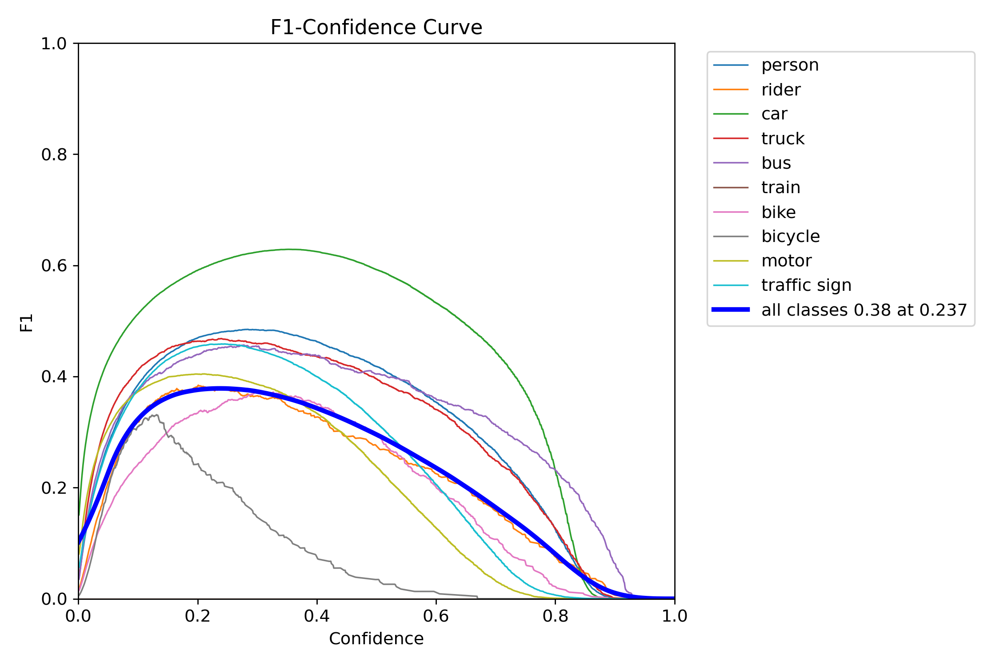
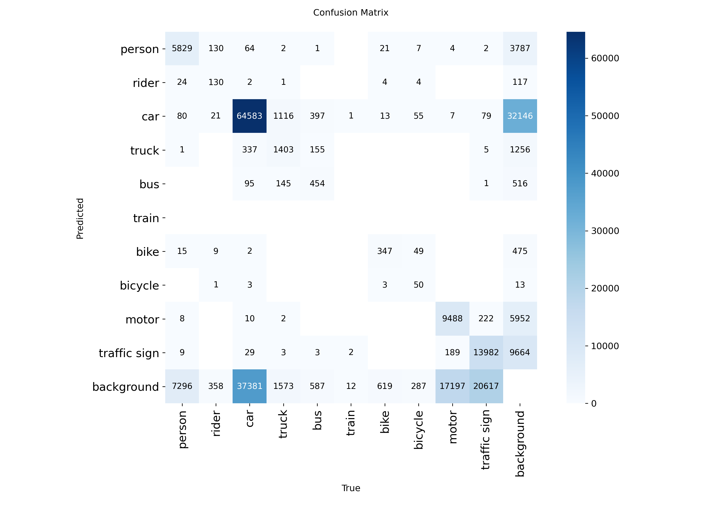
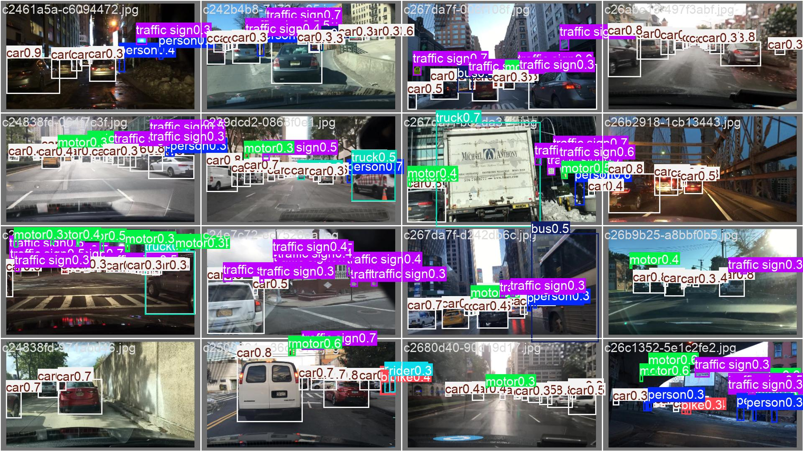

# BDD100K Training Pipeline

## Overview

This repository demonstrates a basic object detection training pipeline on the BDD100K dataset using the Ultralytics YOLO11m model.

The goal is to showcase:

- Dataset loading and configuration
- Transfer learning using pretrained weights
- Data augmentation
- Model training and validation
- Reproducible experimentation

As suggested in the assignment, the model was trained for **1 epoch** to demonstrate the complete training workflow without requiring extensive computational resources.

---

## Model

The selected model is **YOLO11m**, a modern one-stage object detector from the Ultralytics framework.

### Why YOLO11m?

- Good balance between accuracy and inference speed
- Suitable for real-time ADAS applications
- Supports transfer learning
- Easy deployment to edge devices

A detailed discussion of model selection and architecture is provided in `MODEL_SELECTION.md`.

---

## Dataset

The BDD100K dataset was converted into YOLO format.

### Dataset Structure

```text
bdd_yolo/
├── images/
│   ├── train/
│   └── val/
├── labels/
│   ├── train/
│   └── val/
└── bdd_yolo.yaml
```

---

## Training Configuration

| Parameter | Value |
|------------|--------|
| Model | YOLO11m |
| Epochs | 1 |
| Batch Size | 8 |
| Image Size | 480 |
| Optimizer | AdamW |
| Learning Rate | 0.001 |
| Weight Decay | 0.0005 |

### Transfer Learning

The model is initialized using pretrained weights:

```python
model = YOLO("yolo11m.pt")
```

The first 15 layers are frozen to preserve low-level visual features learned during pretraining:

```python
freeze=15
```

---

## Data Augmentation

The following augmentations are applied during training:

```python
hsv_h=0.015
hsv_s=0.7
hsv_v=0.4

degrees=10
translate=0.1
scale=0.5
shear=2.0
```

These augmentations improve robustness to lighting, viewpoint, and scale variations commonly encountered in driving scenarios.

---


## Running Training

Install dependencies:

```bash
pip install ultralytics torch
```

Run training:

```bash
python train.py
```

---

## Outputs

The training process automatically generates:

- Model checkpoints (`best.pt`, `last.pt`)
- Training and validation metrics

- Loss curves
- Confusion matrix

- Prediction visualizations



Output directory:

```text
runs/
└── bdd100k/
    └── yolo11m_bdd/
```

---

## Conclusion

A complete training pipeline was implemented using YOLO11m and the BDD100K dataset. The experiment demonstrates dataset loading, transfer learning, augmentation, training, and validation. While only a single epoch was executed for demonstration purposes, the pipeline can be extended for full-scale training and evaluation.